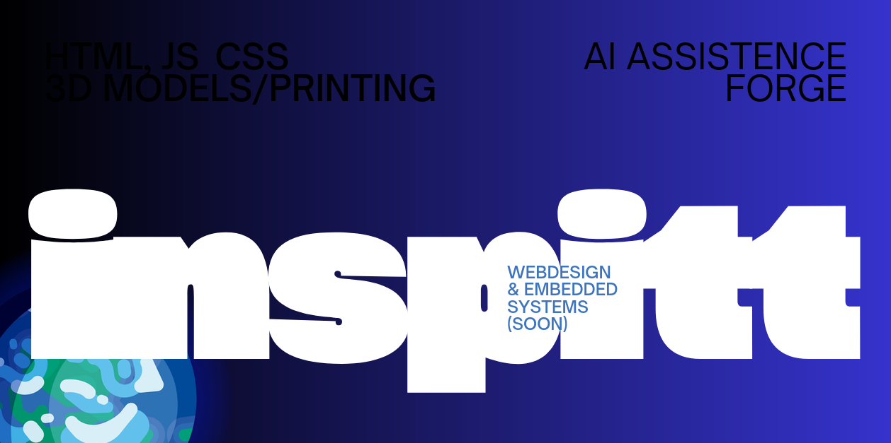

# About me 

<picture>
  " width="100%"
</picture>

# inspitt

**Introduction**

> Hi! I'm inspitt, I'm currently in my exam year for middle school (17y/o) and will be starting with a major in CS after that. 
> I have been interested in computers and whatnot since I was a wee lad, and I've picked up some skills along the way.

## Current skillset
 ### -Html, Css and Js - web design
 ### -Basic C++ rendering - OpenGL
 -More to be added of course
 

    

## Working on
### -A webserver written in ASP.net with C#

Check out [Ouroboros](https://discord.gg/ecpZqNqytT/) here (closed beta for the time being)

`webserver` `asp.net` `C#`

### -Learning basic electronics

No related projects yet 

### -Figuring out 3d printing and prototyping things with real life purpose.

Check out [The forge](https://forge.inspitt.nl/) or the [repo](https://github.com/in-spit/TheForge/)

## The rest of my work:
> For all my completed work, look either at my github page (where you are right now),
> or move over to my portfolio page: https://portfolio.inspitt.nl
